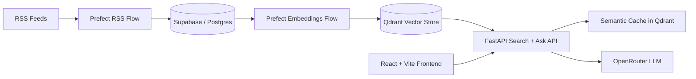

# Substack Articles Search Engine

An end-to-end AI research stack for ingesting newsletter content, indexing it in a hybrid vector database, and answering questions with semantic search + generation.

## Tech Stack

### Core Platform


### Data + AI


### Orchestration + Observability + Delivery


## What It Does

- Ingests curated RSS newsletters into SQL storage.
- Builds dense + sparse vectors and indexes them in Qdrant.
- Exposes a FastAPI search/ask interface with streaming responses.
- Uses a semantic cache in Qdrant for repeated queries.
- Provides a React UI for filtering and querying.

## Architecture



## Project Structure

```text
.
├── .github/
│   └── workflows/
│       ├── ci.yaml
│       └── cd.yaml
├── frontend/
│   ├── index.html
│   ├── package.json
│   ├── vite.config.js
│   └── src/
│       ├── main.jsx
│       ├── App.jsx
│       └── styles.css
├── src/
│   ├── api/
│   │   ├── main.py
│   │   ├── exceptions/
│   │   │   └── exception_handlers.py
│   │   ├── middleware/
│   │   │   └── logging_middleware.py
│   │   ├── models/
│   │   │   ├── api_models.py
│   │   │   └── provider_models.py
│   │   ├── routes/
│   │   │   ├── health_routes.py
│   │   │   └── search_routes.py
│   │   └── services/
│   │       ├── generation_service.py
│   │       ├── search_service.py
│   │       ├── semantic_cache_service.py
│   │       └── providers/
│   │           ├── openrouter_service.py
│   │           └── utils/
│   │               ├── evaluation_metrics.py
│   │               ├── messages.py
│   │               └── prompts.py
│   ├── configs/
│   │   └── feeds_rss.yaml
│   ├── infrastructure/
│   │   ├── qdrant/
│   │   │   ├── create_collection.py
│   │   │   ├── create_indexes.py
│   │   │   ├── delete_collection.py
│   │   │   ├── ingest_from_sql.py
│   │   │   └── qdrant_vectorstore.py
│   │   └── supabase/
│   │       ├── create_db.py
│   │       ├── delete_db.py
│   │       └── init_session.py
│   ├── models/
│   │   ├── article_models.py
│   │   ├── sql_models.py
│   │   └── vectorstore_models.py
│   ├── pipelines/
│   │   ├── flows/
│   │   │   ├── rss_ingestion_flow.py
│   │   │   └── embeddings_ingestion_flow.py
│   │   └── tasks/
│   │       ├── fetch_rss.py
│   │       ├── ingest_rss.py
│   │       └── ingest_embeddings.py
│   ├── utils/
│   │   ├── logger_util.py
│   │   └── text_splitter.py
│   └── config.py
├── .env.example
├── .python-version
├── Dockerfile
├── LICENSE
├── main.py
├── Makefile
├── prefect.yaml
├── pyproject.toml
├── requirements.txt
└── uv.lock
```

### Directory Responsibilities

- `.github/workflows/ci.yaml`: CI pipeline for install, hooks, env checks, and tests.
- `.github/workflows/cd.yaml`: CD pipeline for Prefect deployments.
- `frontend/src/App.jsx`: Main UX for search, ask, streaming answer display, and filters.
- `frontend/src/styles.css`: Visual design system for layout and typography.
- `src/api/main.py`: FastAPI app bootstrap, middleware wiring, startup resources.
- `src/api/routes/search_routes.py`: Endpoints for unique title search and ask flows.
- `src/api/routes/health_routes.py`: Liveness/readiness endpoints.
- `src/api/services/search_service.py`: Retrieval logic against Qdrant.
- `src/api/services/generation_service.py`: Answer generation orchestration.
- `src/api/services/semantic_cache_service.py`: Semantic response cache in Qdrant.
- `src/api/services/providers/openrouter_service.py`: OpenRouter model calls.
- `src/config.py`: Central settings model and env parsing.
- `src/configs/feeds_rss.yaml`: Feed catalog powering ingestion and UI filter options.
- `src/infrastructure/supabase/`: SQL DB setup and session management.
- `src/infrastructure/qdrant/`: Vector collection lifecycle and ingestion scripts.
- `src/pipelines/flows/`: Prefect entrypoint flows.
- `src/pipelines/tasks/`: Units of work used by Prefect flows.
- `src/models/`: Pydantic + SQL/vector data contracts.
- `prefect.yaml`: Prefect deployment definitions and schedules.
- `Makefile`: Developer shortcuts for API, ingestion, DB, and vector ops.

## Request Flow

1. User asks a question in the frontend.
2. API checks semantic cache first.
3. If miss: API performs hybrid search (dense + sparse) in Qdrant.
4. API builds prompt context and calls OpenRouter.
5. API returns answer (streaming or non-streaming) and stores result in cache.

## API Endpoints

- `GET /health` - liveness check.
- `GET /ready` - readiness check against Qdrant.
- `POST /search/unique-titles` - title-only retrieval with filters.
- `POST /search/ask` - non-streaming answer generation.
- `POST /search/ask/stream` - streaming answer generation.

## Local Development

### Prerequisites

- Python 3.13 (see `.python-version`)
- Node.js 18+
- `uv`
- Docker (optional, for containerized runs)

### 1) Backend Setup

```bash
uv sync
```

Create `.env` from `.env.example` and fill required secrets.

### 2) Run API

```bash
make run-api
```

### 3) Run Frontend

```bash
make run-react
```

Frontend expects:

- `VITE_API_BASE=http://localhost:8080` (or your deployed Railway URL)

### 4) Common Data/Index Commands

```bash
make qdrant-create-collection
make qdrant-create-indexes
make ingest-rss-articles-flow
make ingest-embeddings-flow
```

## Environment Variables

The project uses nested settings with `__` separators.

### Core

- `SUPABASE_DB__TABLE_NAME`
- `SUPABASE_DB__HOST`
- `SUPABASE_DB__NAME`
- `SUPABASE_DB__USER`
- `SUPABASE_DB__PASSWORD`
- `SUPABASE_DB__PORT`
- `QDRANT__URL`
- `QDRANT__API_KEY`
- `QDRANT__COLLECTION_NAME`
- `OPENROUTER__API_KEY`
- `OPENROUTER__API_URL`
- `ALLOWED_ORIGINS`

### Semantic Cache

- `QDRANT__SEMANTIC_CACHE_COLLECTION_NAME` (default: `semantic_cache`)
- `QDRANT__SEMANTIC_CACHE_SIMILARITY_THRESHOLD` (default: `0.92`)
- `QDRANT__SEMANTIC_CACHE_TTL_SECONDS` (default: `3600`)
- `QDRANT__SEMANTIC_CACHE_CONTENT_VERSION` (default: `v1`)

### Optional

- `HUGGING_FACE__API_KEY`
- `HUGGING_FACE__MODEL`
- `OPIK__API_KEY`
- `OPIK__PROJECT_NAME`

## Deployment

### Railway (Backend API)

This repo is containerized via `Dockerfile` and ready for Railway.

1. Create Railway project from GitHub.
2. Select this repo.
3. Railway builds Docker image and runs `uvicorn` on `${PORT:-8080}`.
4. Configure service variables (core env vars above).
5. Set health check path to `/health`.

Notes:

- CORS value should be a plain comma-separated origin list.
- Example: `ALLOWED_ORIGINS=https://your-frontend.vercel.app`

### Vercel (Frontend)

1. Import the same repo in Vercel.
2. Set **Root Directory** to `frontend`.
3. Framework preset: Vite.
4. Add env var:
	 - `VITE_API_BASE=https://your-railway-domain.up.railway.app`
5. Deploy.

### Prefect (Pipelines)

This project defines deployments in `prefect.yaml`:

- `rss-ingest` flow
- `qdrant-embeddings` flow

Deployment is automated through GitHub Actions (`.github/workflows/cd.yaml`) using `PrefectHQ/actions-prefect-deploy`.

Required Prefect secrets in CI:

- `PREFECT__API_KEY`
- `PREFECT__WORKSPACE`
- `PREFECT__API_URL`

## CI/CD Overview

- **CI** (`.github/workflows/ci.yaml`): installs dependencies, runs pre-commit hooks, validates env presence, runs tests.
- **CD** (`.github/workflows/cd.yaml`): deploys Prefect flow definitions.

## Why This Project Is Interesting

- Hybrid retrieval (dense + sparse) for practical relevance.
- Semantic cache to reduce repeated LLM cost/latency.
- Clear separation of ingestion, indexing, and serving layers.
- Production-ready split deployment: Railway API + Vercel frontend + Prefect orchestration.

## License

MIT (see `LICENSE`).
